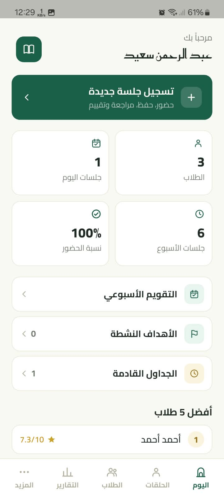

# سمَّعلي (Samma3ly)

تطبيق موبايل لمعلّم/معلّمة تحفيظ القرآن الكريم — لمتابعة الطلاب، تسجيل
جلسات الحفظ والمراجعة الفردية والجماعية (الحلقات)، تقييم التسميع، تتبّع
الحفظ بالجزء/الربع، الأهداف، التقارير، والتذكيرات — كل ده من الموبايل،
بدون إنترنت (بيانات محلية بالكامل على الجهاز).

Built with Flutter — offline-first, single-teacher Quran memorization
tracker: students, individual & group (حلقات) recitation sessions with
4-criteria evaluation, manual juz/quarter memorization progress, goals,
weekly scheduling, notifications, reports, and local JSON backup/restore.

## تحميل التطبيق

آخر إصدار APK متاح دايماً من [صفحة الإصدارات (Releases)](https://github.com/Abd-Alrahman-Saed/Samma3ly/releases/latest) — نزّل ملف `.apk` وثبّته مباشرة على جهاز أندرويد.

## المزايا

- إدارة الطلاب والحلقات (المجموعات)، بمعلّم واحد لكل تطبيق (بلا تسجيل دخول معقّد).
- جلسات فردية وجماعية، بحضور وتقييم بأربعة معايير (حفظ/تجويد/طلاقة/تشكيل) لكل من الحفظ الجديد والمراجعة.
- قرار سريع بعد التسميع (اجتاز/يُعاد) يظهر في كل قوائم الجلسات — يعرف المعلّم فوراً أي جلسة تحتاج إعادة.
- تتبّع الحفظ يدوياً بالجزء والربع، مع أهداف قابلة للمتابعة.
- جدول أسبوعي متكرر للحلقات، وتقويم أسبوعي موحَّد لكل الجلسات.
- تذكيرات محلية قابلة للتخصيص لمواعيد المراجعة والحلقات.
- تقارير عامة وتقرير مفصَّل لكل طالب، قابل للمشاركة.
- نسخ احتياطي واستعادة (JSON) — كل البيانات على الجهاز، بلا خادم خارجي.
- عربي بالكامل (RTL)، خط Cairo، تصميم مخصَّص (راجع `docs/DESIGN_SPEC.md`).

## لقطات من التطبيق

<table>
<tr>
<td align="center" width="25%"><br/>الرئيسية</td>
<td align="center" width="25%"><br/>الجلسات</td>
<td align="center" width="25%"><br/>شاشة الجلسة</td>
<td align="center" width="25%"><br/>شاشة الجلسة (تقييم)</td>
</tr>
<tr>
<td align="center"><br/>الحلقات</td>
<td align="center"><br/>معلومات الحلقة</td>
<td align="center"><br/>مواعيد الحلقات</td>
<td align="center"><br/>الطلاب</td>
</tr>
<tr>
<td align="center"><br/>صفحة الطالب</td>
<td align="center"><br/>المحفوظ من القرآن</td>
<td align="center"><br/>شاشة الهدف</td>
<td align="center"><br/>التقويم الأسبوعي</td>
</tr>
<tr>
<td align="center"><br/>التقارير</td>
<td></td>
<td></td>
<td></td>
</tr>
</table>

## التقنيات

- [Flutter](https://flutter.dev) + [Riverpod](https://riverpod.dev) لإدارة الحالة.
- [Drift](https://drift.simonbinder.eu) (SQLite) للتخزين المحلي، مع نظام ترقية schema صارم (راجع `docs/IMPLEMENTATION_PLAN.md`).
- [go_router](https://pub.dev/packages/go_router) للتنقّل.
- `flutter_local_notifications` للتذكيرات المحلية.

## التشغيل محلياً

```bash
flutter pub get
dart run build_runner build --delete-conflicting-outputs
flutter run
```

## الاختبارات

```bash
flutter test
```

راجع `docs/IMPLEMENTATION_PLAN.md` لتفاصيل كل قرار تنفيذي ولماذا، و`docs/DESIGN_SPEC.md` لنظام التصميم الكامل (الألوان، الخطوط، الأيقونات).

## تحديثات مستقبلية (Roadmap)

أفكار مطروحة للتطوير القادم — مرحِّبين بالمساهمة في أي منها:

- تحديث نظام التسميع ليكون بالصفحات والأرباع، لا بالآيات فقط.
- تحديث تلقائي للأجزاء المحفوظة بدل التسجيل اليدوي.
- نظام مراجعة مخصَّص لكل طالب.
- نسخة للطالب ونسخة لولي الأمر، بدل نسخة واحدة للمعلّم فقط.
- نظام تسميع أونلاين: مكالمات مباشرة (live) مسجَّلة، وتسجيلات صوتية يرسلها الطالب ويقيّمها المعلّم.
- تحديث نظام التقارير، مع متابعة دورية لأولياء الأمور واستفسارات.
- إمكانية إضافة أكثر من معلّم، واختيار المعلّم من قِبل ولي الأمر أو الطالب.
- نظام اختبارات للطالب.
- مجالس شرح متون وفقه وعقيدة للطالب، مع اختبارات — بالتعاون مع منصّات متخصّصة في هذا المجال (مثل الفرقان)، بحيث يصبح التطبيق منصّة متكاملة لتنشئة الطالب على ديننا الحنيف.
- وأفكار أخرى إن وجدت.

## المساهمة

المشروع مفتوح المصدر ومرحِّب بالمساهمات — Issues وPull Requests مرحَّب
بيهم. لو بتضيف تعديلاً على الـschema (Drift)، اتّبع انضباط الترقية
الموثَّق في `docs/IMPLEMENTATION_PLAN.md` (نسخة جديدة لكل تعديل schema،
مايتلغيش migration اتعمل قبل كده).

## الترخيص

[MIT](LICENSE)
